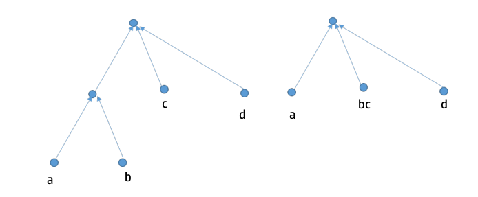

<!--
---
title: Hashing Algebraic Data types
titlepage: true
author: [Ashutosh Upadhye]
date: 2018-04-12
documentclass: report

---

\newpage

# &nbsp;&nbsp;&nbsp;&nbsp; &nbsp;&nbsp;&nbsp;&nbsp;&nbsp;&nbsp; Certificate

*This is to certify that the work contained in this thesis entitled **"Hashing Algebraic Data types"**
is a bonafide work of* ***Upadhye Ashutosh Bharat (111501029)***, *carried out in the Department of Computer Science
and Engineering, Indian Institute  of Technology, Palakkad under my supervision and that it has not been submitted 
elsewhere for a degree.*  
&nbsp;    
&nbsp;    
&nbsp;    
&nbsp;    
&nbsp;    
&nbsp;    
&nbsp;    
&nbsp;    
&nbsp;    

&nbsp;&nbsp;&nbsp;&nbsp;&nbsp;&nbsp;&nbsp;&nbsp;&nbsp;&nbsp;&nbsp; &nbsp;&nbsp;&nbsp;&nbsp;&nbsp;&nbsp;&nbsp;&nbsp;&nbsp;&nbsp;&nbsp; &nbsp;&nbsp;&nbsp;&nbsp;&nbsp;&nbsp;&nbsp;&nbsp;&nbsp;&nbsp;&nbsp; &nbsp;&nbsp;&nbsp;&nbsp;&nbsp;&nbsp;&nbsp;&nbsp;&nbsp;&nbsp;&nbsp; &nbsp;&nbsp;&nbsp;&nbsp;&nbsp;&nbsp;&nbsp;&nbsp;&nbsp;&nbsp;&nbsp; &nbsp;&nbsp;&nbsp;&nbsp;&nbsp;&nbsp;&nbsp;&nbsp;&nbsp;&nbsp;&nbsp; &nbsp;&nbsp;&nbsp;&nbsp;
**Dr. Piyush P Kurur**   
&nbsp;&nbsp;&nbsp;&nbsp;&nbsp;&nbsp;&nbsp;&nbsp;&nbsp;&nbsp;&nbsp; &nbsp;&nbsp;&nbsp;&nbsp;&nbsp;&nbsp;&nbsp;&nbsp;&nbsp;&nbsp;&nbsp; &nbsp;&nbsp;&nbsp;&nbsp;&nbsp;&nbsp;&nbsp;&nbsp;&nbsp;&nbsp;&nbsp;&nbsp;&nbsp;&nbsp;&nbsp;&nbsp;&nbsp;&nbsp;&nbsp;&nbsp;&nbsp;&nbsp;&nbsp;&nbsp;&nbsp;&nbsp;&nbsp; &nbsp;&nbsp;&nbsp;&nbsp; &nbsp;&nbsp;&nbsp;&nbsp;&nbsp;&nbsp;&nbsp;&nbsp;&nbsp;&nbsp;&nbsp;&nbsp;&nbsp;&nbsp;&nbsp;&nbsp;&nbsp;&nbsp;&nbsp;&nbsp;&nbsp;&nbsp;&nbsp;&nbsp;&nbsp;&nbsp;&nbsp;&nbsp;&nbsp;
Associate Professor  
&nbsp;&nbsp;&nbsp;&nbsp;&nbsp;&nbsp;&nbsp;&nbsp;&nbsp;&nbsp;&nbsp; &nbsp;&nbsp;&nbsp;&nbsp;&nbsp;&nbsp;&nbsp;&nbsp;&nbsp;&nbsp;&nbsp; &nbsp;&nbsp;&nbsp;&nbsp;&nbsp;&nbsp;&nbsp;&nbsp;&nbsp;&nbsp;&nbsp; &nbsp;&nbsp;&nbsp;&nbsp;&nbsp;&nbsp;
Department of Computer Science and Engineering  
&nbsp;&nbsp;&nbsp;&nbsp;&nbsp;&nbsp;&nbsp;&nbsp;&nbsp;&nbsp;&nbsp; &nbsp;&nbsp;&nbsp;&nbsp;&nbsp;&nbsp;&nbsp;&nbsp;&nbsp;&nbsp;&nbsp;&nbsp;&nbsp;&nbsp;&nbsp;&nbsp;&nbsp;&nbsp;&nbsp;&nbsp;&nbsp;&nbsp;&nbsp; &nbsp;&nbsp;&nbsp;&nbsp;&nbsp;&nbsp;&nbsp;&nbsp;&nbsp;&nbsp;&nbsp;&nbsp;&nbsp;
Indian Institute of Technology, Palakkad
-->
\newpage

# Acknowledgments

I would like to express my sincere gratitude to my supervisor Dr. Piyush Kurur 
for providing their invaluable guidance, comments, and suggestions throughout 
the course of the project. I would like to especially thank Dr. Piyush Kurur for 
constantly motivating me to work harder. Also, I would like to thank the Haskell 
community which helped me when I got stuck with non-trivial issues. Special thanks
to my parents for emotional and moral support. 

\newpage

# Abstract

In this report, I propose a way to cryptographically hash algebraic data types. 
The Hashing protocol essentially involves converting the algebraic datatype to 
a Sakura tree hash coding. Cryptographic hashing of algebraic data types is a 
nontrivial problem. In order to Hash algebraic data types in Haskell, one must 
ensure that different values of same data types yield different hashes while 
ensuring that the same hash is not generated by any value of some other data type. 

\newpage

# 1. Introduction

Algebraic Datatype is an essential component of Functional Programming. 
An algebraic datatype is a kind of composite type formed by combining sums and 
products. 
There are many real-world applications of Algebraic Data types which make
programming intuitive, and efficient. 

Hashed data structures have a lot of applications. If we find a way to hash Algebraic Data types, we could essentially hash every data structure that can be represented as Algebraic Data types in Haskell. 

Cryptographic Hash of algebraic data types has a multitude of applications ranging 
from networking to blockchains.  Cryptographic hashing of algebraic data types is 
a non-trivial problem. In order to Hash algebraic data types in Haskell, one must 
ensure that different values of same data types yield different hashes while 
ensuring that the same hash is not generated by any value of some other data type. 

Algebraic data types can be easily represented using trees and thus a tree hashing mode 
is the most suitable for hashing Algebraic Data types. Sakura is the most generalized 
tree hash protocol. Sakura hashing protocol takes a hashing mode, in shape the of a tree 
and a string and generates a cryptographic hash. The hashing mode could be of various shapes and specifications, thus accommodating complex data types. 

Also, the process of hashing data types is fairly mechanical, and thus it could be done generically using generic programming working with structural polymorphism. 

\newpage

# 2. Algebraic Data Types

## 2.1. Introduction

In computer programming, especially functional programming, and type theory,
an algebraic data type is a kind of composite type, i.e., a type formed by
combining other types.

Algebraic data types in Haskell have one or more constructors. Each data
constructor can have zero or more arguments. The definitions can be recursive
too.

We can define functions on algebraic data types using pattern matching.
Pattern matching is essentially
matching values against patterns. Apart from allowing one to match patterns,
algebraic data types also bind the variables to successful matches. 

## 2.2. Example of Algebraic Data Type
We can define dimensions of a circle completely using its radius and a rectangle using its length and breadth. Thus we can define the data types `Circle` and `Rectangle` as follows. 
```haskell
    data Circle    = Radius Float
    data Rectangle = Rect Float Float
```
The area of a circle is $\pi (radius)^{2}$ and that of a rectangle is $length \cdot breadth$ Now in order to define area functions, we would have to define two separate functions.
```haskell
    areaCircle :: Circle -> Float
    areaCircle Radius r = 3.14 * r * r

    areaRectangle :: Rectangle -> Float
    areaRectangle Rect l b = l * b
```
Here, we still need to write two functions for calculating areas of circle and rectangle. However, pattern matching can be used to achieve a higher level of abstraction. Instead of defining two data types `Circle` and `Rectangle`, let's define a more general datatype `Shape`.
```haskell
    data Shape = Rectangle Int Int
               | Circle Int
```
The datatype Shape can easily be enhanced by adding more constructors, like `| Square Int`. Now, we could pattern match on constructor names while defining the function `area` as follows.
```haskell
    area :: Shape -> Int
    area (Rectangle l b) = l * b
    area (Circle r) = 3.14 * r * r
```
```haskell 
    rec = Rectangle 3 4
    main = print $ area rec
```
In order to correctly define a function, we have to define it for all possible constructors. 

## 2.3. More Examples
### 2.3.1. Binary Tree
A binary tree is a tree whose elements have at most 2 children. A binary tree in Haskell could be defined easily as follows. 
```haskell
    data BTree a = BEmptyTree 
            | BNode a (BTree a) (BTree a)
```
This is a recursive definition; a `BTree` of type `a` is either a `BEmptyTree` or a `BNode` that contains an element of type `a` and two children `BTree`s of type `a`.

### 2.3.2. Rose Tree
A multi-way tree or a Rose Tree is a tree with a variable and an unbounded number of branches per node. Following is the definition of Rose Tree in Haskell.
```Haskell
    data RTree a = REmptyTree
            | RNode a [RTree a]
```
In a Rose Tree, the node can consist of any number of children as captured by the data structure `[RTree a]` i.e a list of rose trees. 

### 2.3.3. List
A `List` of type `a` is an ordered collection of elements of type `a`. In Haskell, we can define list as follows.
```haskell
    data List a = Nil
                | Cons a (List a)
```

\newpage

# 3. Hashing 

A hash function is any function that can be used to map data of arbitrary size
to data of a fixed size. The values returned by a hash function are called hash
values, hash codes, digests, or simply hashes. Hash functions are often used
in combination with a hash table, a common data structure used in computer
software for rapid data lookup. Hash functions accelerate table or database
lookup by detecting duplicated records in a large file. One such application is
finding similar stretches in DNA sequences. They are also useful in cryptography.
A cryptographic hash function allows one to easily verify that some input data
maps to a given hash value, but if the input data is unknown, it is deliberately
difficult to reconstruct it (or any equivalent alternatives) by knowing the stored
hash value. This is used for assuring the integrity of transmitted data and is the
building block for HMACs, which provide message authentication.


## 3.1. Constructing a Hash Function

Figure 1 represents a method used to create Hashes of input strings. The method
is called Merkle Dangard construction. 
In cryptography, the Merkle–Damgård construction or Merkle–Damgård hash function is a method of building collision-resistant cryptographic hash functions from collision-resistant one-way compression functions. This construction was used in the design of many popular hash algorithms such as MD5, SHA1, and SHA2.

The Merkle–Damgård hash function first applies an MD-compliant padding function to create an input whose size is a multiple of a fixed number (e.g. 512 or 1024) — this is because compression functions cannot handle inputs of arbitrary size. The hash function then breaks the result into blocks of fixed size and processes them one at a time with the compression function, each time combining a block of the input with the output of the previous round. In order to make the construction secure, Merkle and Damgård proposed that messages be padded with a padding that encodes the length of the original message. This is called length padding or Merkle–Damgård strengthening. 

In the diagram, the one-way compression function is denoted by the block labeled 
`Compression Function`, and transforms two fixed length inputs to an output of the 
same size as one of the inputs. The algorithm starts with an initial value, the 
initialization vector (`IV`). The IV is a fixed value (algorithm or implementation specific).
For each message block, the compression (or compacting) function f takes the result so far, 
combines it with the message block, and produces an intermediate result. The last block is 
padded with zeros as needed and bits representing the length of the entire message are 
appended. 

{width=350px}

## 3.2. Tree Hashing

Tree Hashing Deals with Hash Functions whose data flow from the leaves to the root of a graph-theoretical tree. A very popular tree hashing method has been proposed by Merkle and Damgard in 1989. It has been an optional or integral part of several SHA-3 candidates (MD6, SANDstorm, Skein). It has also been theoretically studied by the Keccak team and they came up with a general tree hashing standard, which is yet to be approved by the NSA.  

Tree hashing protocols unlock parallelism leading to faster hash computations. Apart from that, hash recomputations in case of small message changes is also enabled. Verification of hash could be done without reading all message blocks, using Merkle/Lamport signatures. 

## 3.3. Merkle Tree

Figure 2 shows a simple Merkle tree update sequence. The black nodes represent the update
sequence if the node corresponding to the blue box is changed. Only log(N) hashes are to be computed. 

Also, while computing the hash, nodes on the same level can be computed in parallel at the same time. This is an important property because it makes hashing faster. 

{height=200px}

## 3.4. Collisions in Tree Hashing

Trees in *hashing mode* could be of any shape. Figure 3 represents one such 
illustration. These two hash modes will produce different hash values and involve 
different inner hash functions. The input lengths are compatible with the underlying inner hash functions.

{width=350px}

We need to ensure not to have trivial collisions when having multiple shapes. 
Trivial collisions are the ones that allow one to generate the same hashes for two
different values. One such collision is illustrated in Figure 4. Suppose you use the same inner hash functions at all of the nodes and pass the value `h` to the root inner hash function as shown in the diagram, then we get the same hash in both the cases. 

{width=350px}

This collision can easily be avoided by padding leafs intermediate values that are generated with different values. 

\newpage

## 3.5. Sakura 
Sakura is a tree hash mode which is more flexible than other tree hash modes.
In Sakura, you can have multiple modes of trees. 

More mathematically, Sakura can be defined as the following.

> ```haskell
> Sakura :: Mode -> Innerhash function -> Input -> Hash
> ```

Sakura takes Mode and innerhash function as parameters, along with the input
string that needs to be hashed. A hashing mode can be seen as a recipe for 
computing digests over messages by means of a number of calls to an 
underlying function. The hashing mode splits the message into substrings 
that are assembled into inputs for the inner function. 

## 3.6. How Sakura Hashing works

We represent trees in terms of hops that model how message and chaining values are
distributed over nodes. There are two distinct types of hops: message hops that 
contain only message bits and chaining hops that contain only chaining values.

The hops form a tree, with the root of the tree called the final hop. Such a hop tree
determines the parallelism that can be exploited by processing multiple message hops or
chaining hops in parallel.

An example hop tree from Sakura is shown in figure 5. The Encoding for the
hop tree is represented in Figure 6. 

{width=300px}

{width=300px}

In Figure 5 there are in total 7 hops: 4 message hops $M_{00}$ , $M_{01}$ , $M_{10}$ , 
$M_{11}$ , and three chaining hops $Z_{0}$ , $Z_{1}$ and $Z_{\ast}$. The final node 
contains only the final hop $Z_{\ast}$. The hops $M_{00}$ and $Z_{0}$ are in a single 
node. Similarly, $M_{10}$ and $Z_{1}$ are in a single node. The total number of nodes 
is 5.

## 3.7. Sakura Implementation

### 3.7.1. Capturing the Shape

The operations involved are the following. Concatenating messages, computing hashes, trimming messages, and adding paddings. The shape of Sakura Tree can be captured as follows:

```haskell
data HShape = InnerHash HShape
    | Concat [HShape]
    | Interleaving [HShape]
    | Slice Int Int
    | Pad BStr
```

### 3.7.2. Serial Hash Computation
Hash functions take a Bit String as an input, which is nothing but a list of `Word8` datatype in Haskell.  
```haskell
    type BStr = [Word8]
    type HashF = [Word8] -> [Word8]
```
Here, we define a function that would slice the bit string from `from`$^{th}$ index to `to`$^{th}$ index. 
```haskell
    my_slice :: Int -> Int -> BStr -> BStr
    my_slice from to = (drop from).(take to)
````
The following function takes a hash function, an HShape and a Bit String as the input and produces the required Hash. The Hashing function is fairly simple, if we consider all the cases. 
```haskell
    s :: HashF -> HShape -> BStr -> BStr
    -- Serial Hash Function
    s h (InnerHash aShape) bStr = h $ s h aShape bStr
    s h (Concat l) bStr = concat $ map (\x -> s h x bStr) l
    s _ (Slice from to) bStr = my_slice from to bStr
    s _ (Pad x) _ = x
```

### 3.7.3. Parallel Hash Computation
In above definition, the computation of hashes in Concat l can be parallelised as
follows: 
```haskell
    p :: HashF -> HShape -> BStr -> BStr
    -- Parallel Hash Function
    p h (InnerHash aShape) bStr = h $ p h aShape bStr
    p h (Concat l) bStr =
    concat $ parMap rpar (\x -> p h x bStr) l
    p _ (Slice from to) bStr = my_slice from to bStr
    p _ (Pad x) _ = x
```


### 3.7.4. Wrapper for Sakura

#### Chunker for Merkle Tree
We need to create a HShape for a given string and a given block size. 
```haskell
    chunker :: Int -> Int -> BStr -> BStr -> HShape
    chunker n size innerpad rootpad =
      let
        b = quot n size
        make_node i = InnerHash (Concat[(Slice (i*size) ((i+1)*size)), (Pad innerpad)])
        ranges = map make_node [0 .. b]
        all_ranges =
          if rem n size == 0 then
            ranges
          else
            ranges ++ [InnerHash (Concat [(Slice (b*size) n), (Pad innerpad)])]
      in
        InnerHash (Concat (all_ranges ++ [(Pad rootpad)]))
```

#### `a_block_mode`
```haskell
    a_block_mode x block_size = chunker (length x)
        block_size (toWord8 i_padding) (toWord8 r_padding)
```

Now to calculate hash of any string, 

```haskell
    hash_val = (s hashf (a_block_mode string 1)) string
```

### 3.7.5. Validation of the implementation

Can we really validate if a hashing protocol is actually working?
The code could be validated by using id function as the hash function and
comparing the expected output with the obtained output.
Following are the results of validation of the simple HShapes:
```
    b1 : [97,98,99,100]
    b1': [97,98,99,100]
```
To validate the Merkle shape chunker, I created the Merkle tee from Scratch
and Padded bits as and where required, as per the protocol. The following are
the results.

```
chunker:   [97,73,98,73,99,73,100,73,101,73,102,73,103,73,104,82]
from tree: [97,73,98,73,99,73,100,73,101,73,102,73,103,73,104,82]
```

\newpage

# 4. Generic Programming

## 4.1. Introduction
Generic programming is a style of computer programming in which algorithms are 
written in terms of types to-be-specified-later that are then instantiated when 
needed for specific types provided as parameters. This approach, pioneered by ML 
in 1973, permits writing common functions or types that differ only in the 
set of types on which they operate when used, thus reducing duplication. Such 
software entities are known as generics in Python, Ada, C#, Delphi, Eiffel, F#, 
Java, Rust, Swift, TypeScript and Visual Basic .NET. 

Generic programming is a powerful way to define a function that works in an 
analogous way for a class of types. Most of the programming languages have some 
sort of generic programming. Some are listed below. 

* Generics in Java / C#
* Templates in C++
* Generic packages in Ada

The goal of generic programming is often the same, that is to achieve a higher 
level of abstraction than "normally" available. 

The technique is also often the same: some form of parametrization and instantiations. 

Example of Generic programming in Java / C#.
```Java
    public class Stack<T>
    {
        public void push (T item) {..}
        public T pop () {..}
    }
```
\newpage
Example of Generic Programming in C++.
```cpp
    template <typename T, typename Compare>
    T & min (T&a, T&b, Compare comp) {
        if (comp (b, a))
            return b;
        return a;
    }
```


## 4.2. Generic Programming in Haskell

### 4.2.1. Parametric Polymorphism
In programming languages and type theory, parametric polymorphism is a way to make a 
language more expressive, while still maintaining full static type-safety. Using 
parametric polymorphism, a function or a data type can be written generically so 
that it can handle values identically without depending on their type.

In Haskell, parametric polymorphism refers to when the type of a value contains one or more (unconstrained) type variables, so that the value may adopt any type that results from substituting those variables with concrete types.

For example, 
```haskell
    id  :: a -> a
    map :: (a -> b) -> [a] -> [b]
```
`a` and `b` are unconstrained types and could be any kind of type, making the functions `id` and `map` more generic in some sense. 

This is similar to generic programming in Java and C#. Parametric polymorphism is native to Haskell and so we don't call it generic programming. 

### 4.2.2. Ad-hoc Polymorphism
Ad-hoc polymorphism refers to when a value is able to adopt any one of several types because it, or a value it uses, has been given a separate definition for each of those types. For example, the + operator essentially does something entirely different when applied to floating-point values as compared to when applied to integers – in Python it can even be applied to strings as well. Most languages support at least some ad-hoc polymorphism, but in languages like C it is restricted to only built-in functions and types. Other languages like C++ allow programmers to provide their own overloading, supplying multiple definitions of a single function, to be disambiguated by the types of the arguments. In Haskell, this is achieved via the system of type classes and class instances.

In Haskell, this is achieved via the system of type classes and class instances.

So, for example, if my type can be compared for equality (most types can, but some, particularly function types, cannot) then I can give an instance declaration of the `Eq` class. All I have to do is specify the behaviour of the `==` operator on my type, and I gain the ability to use all sorts of functions defined using that operator, e.g. checking if a value of my type is present in a list, or looking up a corresponding value in a list of pairs.
```haskell
    class Eq a where 
        (==) :: a -> a -> Bool
```

This is similar to generic programming in C++ templates. Type classes make ad hoc polymorphism sort of native to the language, so we don't call it generic programming in Haskell. 

### 4.2.3. Polytypism: Shape/Structure polymorphism. 

Can there be a higher level of abstraction? Can we abstract over isomorphic types, the ones that have similar representations? 

When we abstract over the shapes and structures of the data types, it is known as polytypism or shape/structural polymorphism. 

## 4.3. Generic Representation of Algebraic Data types

A datatype can have *parameters*, *alternatives* and *fields*. The following datatype `D` is parametrized on type variable `p` and can either be `Alt1` or a pair of an `Int` and the parameter `p` wrapped in the constructor `Alt2`.
```haskell
data D p = Alt1 | Alt2 Int p
```

### 4.3.1. Alternatives
Alternatives are often called as **sums**. A typical datatype consisting only of 
alternatives is shown below. The datatype `AltEx` can either be an `Int` or a `Char`.
```haskell
    data AltEx = A1 Int | A2 Char
```
The Alternatives are very similar to another datatype `Either`. We use a similar datatype, `:+:`to 
represent alternatives generically. 
```haskell
    data a :+: b = L a | R b
```
This can also be used to represent types with more than 2 alternatives. For example the following datatype `AltEx2`,
```haskell
    data AltEx2 = B1 Int | B2 Char | B3 Float
```
could be easily represented using nesting as follows. 
```haskell
    type AltEx2 = Int :+: (Char :+: Float)
    -- Note the smart constructors:
    b1 :: Int -> AltEx2
    b1 = L
    b2 :: Char -> AltEx2
    b2 = R. L
    b3 :: Float -> AltEx2
    b3 = R . R
```

### 4.3.2. Fields
Fields are often called as **products**. A typical datatype consisting only of fields is shown below. The dataype `FldEx` is a pair of `Int` and a `Char` wrapped around a constructor.
```haskell 
    data FldEx = FldEx Int Char
```
The Fields are very similar to another datatype, the pair, `(,)` function. We use a similar datatype, `:*:` to represent fields generically.  
```haskell
    data a :*: b = a :*: b  
```
This can also be used to represent types with more than 2 alternatives. For example the following datatype `FldEx2`,
```haskell
    data FldEx2 = FldEx2 Int Char Float
```
could be easily represented using nesting as follows. 
```haskell
    type FldEx2' = Int :*: (Char :*: Float)
    -- note the smart constructor. 
    fldEx2' :: Int -> Char -> Float -> FldEx2'
    fldEx2' x y z = x :*: (y :*: x)
```

### 4.3.3. Sum of Products 
Algebraic Data types in Haskell could now be represented generically as sums of products as follows. The datatype `D` that takes a parameter `p` is defined as follows. 
```haskell
    type D p = Alt1 | Alt2 Int p
```
We will use _unit_ type `data U = U`, _(identical to standard type,_ `()`_)_ to represent an alternative without fields.For this datatype `D`, we can define an identical datatype `RepD` as follows.
```haskell
    type RepD p = U :+: Int :*: p
```

### 4.3.4. Isomorphism
In order to prove that `RepD` correctly represents `D` we need to construct an isomorphism 
An isomorphism is a way of casting types into each other without loss of information. It is essentially an equivalence relation between the types. 

So, for `RepD` and `D` we define the following isomorphism. 
```haskell
    fromD :: D p -> RepD p
    fromD Alt1 = LU
    fromD (Alt2 i p) = R (i :*: p)
    toD :: RepD p D p
    toD (L U) = Alt1
    toD (R (i :*: p)) = Alt2 i p
```

This isomorphism allows us to convert from `RepD` to `D` without any loss of information, and hence `RepD` is a valid representation of `D`. 

### 4.3.5. Type representation: Metadata
The above mentioned way of representation is complete but we can add more information in the representation like Constructors and other metadata. 
```haskell
    data C a = C String a
```
And, `RepD` can now be more informative. 
```haskell
    type RepD p = C U :+: C (Int :*: p)
    fromD Alt1 = L (C "Alt1" U)
    fromD (Alt2 i p) = R (C "Alt2" (i :*: p))
```


## 4.4. Generic Functions
A function that is defined on each possible case of the structural representation of data types is a generic function. 
A generic function will work for every type that has an isomorphism to the generic representation  of the data types.

Let's look at a generic function show. 

### 4.4.1. `show`: a Generic Function

The type signature of `show` is as follows.
```haskell
    show :: a -> String
```

In order to completely define `show` we need to define it for all possible structure cases. 

* Unit: 
```haskell
    showU :: U -> String
    showU U = ""
```

* Constructor name:
```haskell
    showC :: (a -> String) -> C a -> String
    showC sA (C name a) = "(" ++ name ++ " " ++ sA a ++ ")"
```

* Binary Product:
```haskell
    showP :: (a -> String)->(b -> String) -> a:*:b -> String
    showP sA sB (a:*:b) = sA a ++ " " ++ sB b
```
* Binary Sum:
```haskell
    showS :: (a -> String)->(b -> String) -> a:+:b -> String
    showS sA _ (L a) = sA a
    showS _ sB (R b) = sB b
```

Now `show` for RepD can be defined as:
```haskell
-- assumming showInt is known. 
    showRepD :: (p -> String) -> RepD p -> String
    showRepD sP = showS (showC showU) (showC (showP sInt sP))
```
The representation has a fairly predictable pattern. The above functions are sort of recursive, but with differing arguments. 

### 4.4.2. Polymorphic Recursion

Polymorphic functions are functions with a common scheme that reference each other and allow types to change in the calls. Polymorphic recursion can be encoded in several ways. One of the ways is using the type classes. The class declaration specifies the type signature for the class. Standard classes already use polymorphic recursion for deriving instances. 

Thus, we can define a class `Show` as follows. 
```haskell
    class Show a where
      show a :: a -> String
```

Every instance of Show will have a `show` function defined. Let's have a look at the instances. 

* Unit:
```haskell
    instance Show U where
      show = showU
```
* Constructor name:
```haskell
    instance Show a => Show (C a) where
      show = showC show
```
* Binary product:
```haskell
    instance (Show a, Show b) => Show (a :*: b) where
      show = showP show show
```
* Binary sum:
```haskell
    instance (Show a, Show b) => Show (a :+: b) where
      show = showS show show
```
Now, the `show'RepD` function simply becomes
```haskell
    show'RepD :: Show p => RepD p -> String
    show'RepD = show
```
Recall the not so beautiful `showRepD` that we arrived at previously:
```haskell
    showRepD :: (p -> String) -> RepD p -> String
    showRepD sP = showS (showC showU) (showC (showP sInt sP))
```

### 4.4.3. Encoding Isomorphism

Now that we have defined `show` function for `RepD`, let's do it for `D`. 
That can be easily done by defining another function as follows. 
```haskell
    show'D :: Show p => D p -> String
    show'D = show'RepD . fromD
```

In order to make it more abstract, let's define a type family. The following function pairs implement an isomorphism. 
```haskell
    from :: T -> RepT
    to :: RepT -> T
```
The functions require two types, so each instance must have two types, but since `RepT` is precisely determined by `T`, so we only need one unique type, and a second type derivable from the first. 

## 4.5. Generic Class
Thus, the Generic class can be defined as follows. 
```haskell
    class Generic a where 
      type Rep a
      from :: a -> Rep a
      to :: Rep a -> a
```
`Rep` here is a type family, an associated type synonym. It can be thought of as a function on types. 

> Given a unique type (index) `T`, you get a type synonym, `RepT`.

One important point to be kept in mind is that two types can have the same representations. 

Now, the Generic instance for `D` is,
```haskell
    instance Generic (D p) where
      type Rep (D p) = RepD p
      from = fromD
      to = toD
```

and consequently, the generic `show` function becomes,
```haskell
    gshow :: (Show (Rep a), Generic a) => a -> String
    gshow = show . from
```

\newpage

# 5. DThash

## 5.1. Deriving `toHShape` generically 
Now, we have a sufficient background to hash the Algebraic Data types generically. Let's first try to convert any given datatype to a HShape. That would make understanding the next steps easier. 

Let's recall the `HShape` datatype defined in Shakura implementation. The gtoHShape function will be a generic function that would convert representative types to HShape. 
```haskell
    data HShape =
        InnerHash HShape
        |Concat [HShape]
        |Interleaving [HShape]
        |Slice Int Int
        |Pad String 
        deriving Show
```

In order to get a generic `toHShape` function, let's define what the function could do for all of the basic type representations. Let's start with a generic class `GHashable` that contains a function `gtoHShape` which essentially converts a representative type to its corresponding HShape. 
```haskell
    class GHashable f where 
        gtoHShape :: f a -> HShape
``` 
Now, we would define instances for all representative types. 

* Unit:
```haskell
    instance GHashable U1 where
        gtoHShape U1 = Concat []
``` 
* Product: 
```haskell
    instance (GHashable a, GHashable b) => GHashable (a :*: b) where
        gtoHShape (a :*: b) = Concat [InnerHash (gtoHShape a), InnerHash (gtoHShape b)]
```
* Sum:
```haskell
    instance (GHashable a, GHashable b) => GHashable (a :+: b) where
        gtoHShape (L1 x) = InnerHash (gtoHShape x)
        gtoHShape (R1 x) = InnerHash (gtoHShape x)
```
* Metadata:
```haskell
instance (GHashable a) => GHashable (M1 i c a) where
    gtoHShape (M1 x) = Concat [gtoHShape x]

instance (Show a) => GHashable (K1 i a) where
    gtoHShape (K1 x) = Pad (show x)
```

Now that we have defined instances for representative types, let's define a class `Hashable` which has a function `toHShape`. Here, we would also give a default implementation of the function toHShape. 
```haskell
    class Hashable a where
        toHShape :: a -> HShape
        default toHShape :: (Generic a, GHashable (Rep a)) => a-> HShape
        toHSHape = gtoHShape . from
```

Now, the instance Hashable can be defined without specifically defining the toHShape function. Consider the following datatype. 
```haskell
    data Tree a = EmptyTree 
        | Node a (Tree a) (Tree a) 
        deriving (Generic, Show)

    instance (Hashable a, Show a) => Hashable (Tree a)  
```

## 5.2. DThash protocol

Now, the Sakura protocol needs a bitstream of an input message. It then splits the message as per the requirements of Hashing mode and produces the required output string. 

We can achieve similar effective consequence without having to convert the datatype to a bitstring and then feeding the bitstring to the hashing function. 

Let's redefine the generic `GHashable` class which contains the function `gcomputeHash` as follows.
```haskell
    class GHashable f where 
        gcomputeHash :: HashF -> f a -> BStr
``` 
Now we would define instances for representative types as follows. 
* Unit:
```haskell
    instance GHashable U1 where
        gcomputeHash hashf U1 = hashf (toWord8 "U1")
``` 
* Product: 
```haskell
    instance (GHashable a, GHashable b) => GHashable (a :*: b) where
        gcomputeHash hashf (a :*: b) = 
            concat [toWord8 "Pdt1", 
                    gcomputeHash hashf a, 
                    gcomputeHash 
                    hashf b]
```
* Sum:
```haskell
    instance (GHashable a, GHashable b) => GHashable (a :+: b) where
        gcomputeHash hashf (L1 x) = 
            concat [toWord8 "Sum1L1", gcomputeHash hashf x]
        gcomputeHash hashf (R1 x) = 
            concat [toWord8 "Sum1R1", gcomputeHash hashf x]
```
* Metadata and values:
```haskell
    instance (GHashable a) => GHashable (D1 c a) where
        gcomputeHash hashf (M1 x) = 
            concat [toWord8 "M1D", 
                    gcomputeHash hashf x]

    instance (GHashable a, Constructor c) => GHashable (C1 c a) where
        gcomputeHash hashf m1x@(M1 x) = 
            concat [toWord8 "M1D", 
                    hashf $ toWord8 $ conName (m1x), 
                    gcomputeHash hashf x]

    instance (GHashable a) => GHashable (S1 c a) where
        gcomputeHash hashf (M1 x) = 
            concat [toWord8 "M1S", 
                    gcomputeHash hashf x]

    instance (Show a) => GHashable (K1 i a) where
        gcomputeHash hashf (K1 x) =  
            concat [toWord8 "K1", 
                    hashf (toWord8 $ show x)]
```

Thus, we can now compute hash of any datatype as follows. 
```haskell
    class Hashable a where
        computeHash :: HashF -> a -> BStr
        default computeHash :: (Generic a, GHashable (Rep a)) => HashF -> a -> BStr
        computeHash hashf x = gcomputeHash hashf (from x) 
```

Now, the instance Hashable can be defined without specifically defining the computeHash function. Consider the following datatype. 
```haskell
    data Tree a = EmptyTree 
        | Node a (Tree a) (Tree a) 
        deriving (Generic, Show)

    instance (Hashable a, Show a) => Hashable (Tree a)  
```
\newpage

# 6. Applications 

## 6.1. Blockchain
A blockchain, originally block chain, is a growing list of records, called blocks, which are linked using cryptography. Each block contains a cryptographic hash of the previous block, a timestamp, and transaction data (generally represented as a Merkle tree). 

By design, a blockchain is resistant to modification of the data. It is "an open, distributed ledger that can record transactions between two parties efficiently and in a verifiable and permanent way". For use as a distributed ledger, a blockchain is typically managed by a peer-to-peer network collectively adhering to a protocol for inter-node communication and validating new blocks. Once recorded, the data in any given block cannot be altered retroactively without alteration of all subsequent blocks, which requires consensus of the network majority. Although blockchain records are not unalterable, blockchains may be considered secure by design and exemplify a distributed computing system with high Byzantine fault tolerance. Decentralized consensus has therefore been claimed with a blockchain.

## 6.2. Blockchain without DThash.
Let's explore the data structures required to build a blockchain in Haskell. Let's first define a `Transaction`. A transaction should have the ID of the payee, the ID of the receiver and the amount that has been transfered. 
```haskell
    data Transaction = Transaction { from   :: String   
                                        -- Who's paying
                                   , to     :: String   
                                        -- Who's receiving
                                   , amount :: Float    
                                        -- How much are they paying
                                   } deriving (Generic, Show, Hashable)
```
Next, a block consists of several transactions, and some metadata, which includes the index of the block, the 
```haskell
    data Block = Block { index    :: Int           
                                -- Index of the block
                       , txs      :: [Transaction] 
                                -- List of transactions in the block
                       , hash     :: String        
                                -- Hash of the block
                       , prevHash :: String        
                                -- Prev Hash of the block
                       , nonce    :: Maybe Int     
                                -- Nonce of the block (proof of work)
                       } deriving (Generic, Show, Hashable)
```
Next, we define `hashBlock` function which will be used to hash given blocks. 
```haskell
    hashBlock :: Block -> String
    hashBlock (Block blockIndex blockTxs blockHash prevHash _) 
        = toString $ Base16.encode digest
        where blockTxStr = foldr ((++) . show) "" blockTxs
          ctx = SHA256.updates SHA256.init $ fmap fromString [blockTxStr, prevHash]
          digest = SHA256.finalize ctx
```
Next, we define the `mineBlock` function which will be used to present a proof of work. 
```haskell
    mineBlock :: Block -> Int -> Block
    mineBlock b@(Block i t _ p _) n = case head pow of
                                   '0' -> Block i t blockHash p (Just n)
                                    _   -> mineBlock b (n + 1)
        where blockHash = hashBlock b
          ctx = SHA256.updates SHA256.init (fmap fromString [blockHash, show n, p])
          pow = toString . Base16.encode $ SHA256.finalize ctx      -- proof of work
```

## 6.3. Blockchain with DThash
Now, the `hashBlock` and `mineBlock` functions become extensively simple, when we use DThash. The `dtHashBlock` function is as follows. 
```haskell
    dtHashBlock :: Block -> String
    dtHashBlock (Block _ tracs _ prevHash _) = 
        toString $ Base16.encode (computeHash SHA256 (tracs, prevHash))
```

and the `dtMineBlock` function becomes,
```haskell
    dtMineBlock :: Block -> Int -> Block
    dtMineBlock b@(Block i t _ p _) n = case head pow of 
                                      '0' -> Block i t (dtHashBlock b) p (Just n)
                                      _   -> mineBlock b (n + 1)
        where 
          pow = toString $ Base16.encode (computeHash SHA256 (b,n,p)) -- Proof of work
```

Here, the proof of work is not the same as the previous case, but is equally valid. 

\newpage

# 7. Future Works
The current implementation is a serial implementation of Hash. One could work on parallel 
implementation by first converting the datatype to its string representation, and the Hshapes will have slicing constructors to slice the string precisely to obtain the required subrepresentation of the datatype and then use that HShape to generate the hash. 

\newpage

# 8. Rerefences

1. **Sakura: a flexible coding for tree hashing** by *Guido Bertoni, Joan Daemen, Michael Peeters, and Gilles Van Assche*.

2. **GHC Generics Explained** by *Mark Karpov*.

3. **Aeson: the tutorial** by *Artyom Kazak*.

4. **Rolling your Own Blockchain in Haskell** by *Michael Burge*.

5. **Advantages of Functional Programming for Blockchain Protocols** by *aeternity*.