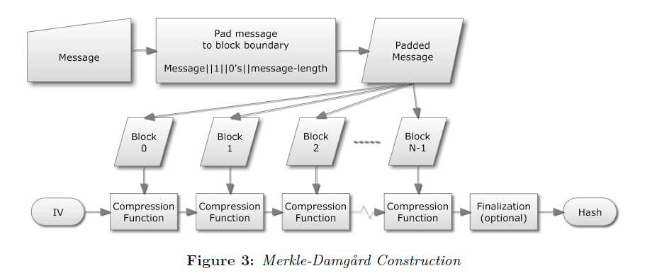
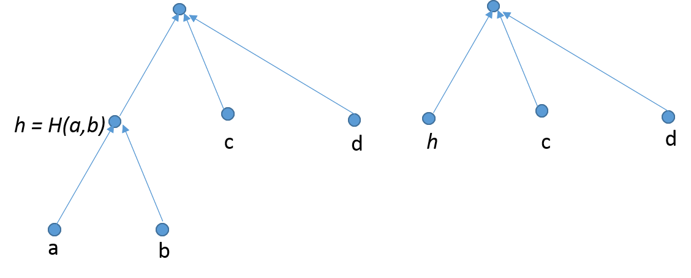

<!-- $theme: default -->

# B Tech Project
_Ashutosh Bharat Upadhye_     
Supervisor: Dr. Piyush P Kurur   

---------------------

# Functional Programming in Haskell

* Everything is an equation.  
* That's pretty much all. JK. 
* _Cannot_ have multi argument functions.
* Think of functions and datatypes as equals. 
* Lazy Evaluation _(evaluates only when necessary)_.
* Algebraic DataTypes.

---------------------

# Algebraic DataTypes
* has one or more data constructors.
* Each data constructor can have zero or more arguments. 
* Can be recursive too.
* Pattern matching: 
	* Match values against patterns.
	* Bind variables to successful matches.

---------------------

## Example
```haskell
data Shape = Rectangle Int Int
	   | Square Int
```
```haskell
area :: Shape -> Int
area (Rectangle len breadth) = len * breadth
area (Square side) = side * side
```
```haskell 
rec = Rectangle 3 4
main = print $ area rec
```
<!-- *footer: taken from 'Bloc: Library for handling large binary objects in Haskell' by Anshu Avinash-->

---------------------

# Some Data Structures in Functional Programming

---------------------

## Binary Tree
```Haskell
BTree a = NullBTree
	| BNode a (BTree a) (BTree a)
```

## Rose Tree
```haskell
RTree a = NullRTree
	| RNode a [RTree a]
```

---------------------

## List
```haskell
List a 	= Nil
	| Cons a (List a)
```
_Looks unfamiliar?_  

Just with some special notation: `[a]` for `List a`, `[]` for `Nil` and `(:)` for `Cons`. 

```haskell
[a] 	= []
	| a : [a]
```

---------------------

# Hashing
A hash function $h$ with some interesting properties.
$$h : \{0,1\}^* \rightarrow \{0,1\}^n$$
* It is extremely easy to calculate $h(x)$. 
* It is extremely computationally difficult to calculate $h^{-1}(y)$.
* It is extremely unlikely that two slightly different messages have the same hash.  

---------------------

## Cryptographic Hash Functions _under the hood_
> Pour the **initial value** in a big cauldron and place it over a nice fire. Now slowly add salt if needed and stir well. Marinade your input string by **appending some strengthened padding**. Now chop the resulting bit string into nice **small pieces of the same size** and stretch each piece to at least four times its original length. Slowly add each single piece while continually stirring at the speed given by the rotation constants and spicing it up with some addition constants. When the **hash stew** is ready, extract a portion of **at least 128 bits** and present this hash value on a warm plate with some
garnish.
> **— Attacks on Hash functions and Applications.**  
<!--*footer:'Attacks on Hash functions and Applications' by Marc Stevens, Universiteit Leiden, 2012.-->

---------------------

## Constructing a Hash Function



---------------------

## Tree Hashing
* Merkle (1980): authenticate any leaf w.r.t. the hash at the root with a logarithmic number of hash computations.
* Enables:
	* Parallel Computation of nodes.
	* Incremental update to the root-hash after a leaf changes. _(old hash values are stored on the nodes.)_

---------------------

## Merkle Tree


---------------------

## About Sakura 
* Tree Hash Mode.
	* More flexible than other tree hash modes.
	* multiple shapes of trees possible.
* Takes an inner hash function as a paramater. 

$$Sakura :: Mode \rightarrow Inner hash function \rightarrow Input \rightarrow hash$$

---------------------

## Tree Shapes


---------------------

## Stupid Collision

`abcd` and `hcd` should not have the same tree hash, otherwise, you have a collision.

---------------------

## Detailed Example _Hop Tree_
An example  hop tree from _Sakura_. 

<!-- *footer: Image from Sakura Paper -->

---------------------

## Encoding the Example
<br>
<div>
  &#160;&#160;&#160; 
  
</div>

---------------------

# Implementation of Sakura

---------------------

## Capturing the Shape
* InnerHash, Concat, Interleave, Slice, Pad
```haskell
	data HShape = InnerHash HShape
		    | Concat [HShape]
  		    | Interleaving [HShape]
  		    | Slice Int Int
  		    | Pad  BStr 
```

---------------------

## Serial Hash Computation
```haskell
type BStr  = [Word8]
type HashF = [Word8] -> [Word8]
```

```haskell
my_slice :: Int -> Int -> BStr -> BStr
my_slice from to = (drop from).(take to)
```

```haskell
s :: HashF -> HShape -> BStr -> BStr
-- Serial Hash Function
s h (InnerHash aShape) bStr = h $ s h aShape bStr
s h (Concat l) bStr = concat $ map (\x -> s h x bStr) l
s _ (Slice from to) bStr = my_slice from to bStr
s _ (Pad x) _ = x
```

---------------------

## Parallel Hash Computation
```haskell
p :: HashF -> HShape -> BStr -> BStr
-- Parallel Hash Function
p h (InnerHash aShape) bStr = h $ p h aShape  bStr
p h (Concat l) bStr = 
  concat $ parMap rpar (\x -> p h x bStr) l
p _ (Slice from to) bStr = my_slice from to bStr
p _ (Pad x) _ = x
```

---------------------

# Algebraic DataTypes and Hashes

---------------------

## Basic Idea
```haskell
class Hashable a where
    data ID a
    type Node a
    hash :: Node a -> ID a
```
```haskell
instance Hashable a => Hashable [a] where
    ID [a] = ListID
    Node [a] = Nil
             | (ID a) : (ID [a])
```