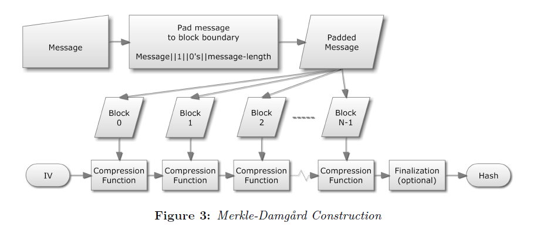

<!-- $theme: default -->

# DT Hash
## B Tech Project
_Ashutosh Bharat Upadhye_     
Supervisor: Dr. Piyush P Kurur   

---------------------

# Algebraic DataTypes and Generics

```haskell
data D p = Alt1 | Alt2 Int p
```

A datatype can have: 
* Parameters: type variables $(\ge 0)$
* Alternatives: unique constructors $(\ge 0)$
* Fields: types for each constructor $(\ge 0)$

Non-syntactic features
* Recursion
* Nesting

-------------

# Structure of Datatypes: Sums
```haskell
data AltEx = A1 Int | A2 Char
```
Note the similarity with Either
```haskell
data Either a b = Left a | Right b
```
In fact, AltEx can be modelled as:
```haskell
type AltEx' = Either Int Char
a1 :: Int -> AltEx'		a2 :: Char -> AltEx'
a1 = Left			a2 = Right
```

-------------

# Structure of Datatypes: Sums

Alternatives are often called as **sums**. We use another _identical_ sum type to represent it, instead of Either. 
```haskell
data a :+: b = L a | R b
```
What about a type with $\gt2$ alternatives? 
```haskell
data AltEx2 = B1 Int | B2 Char | B3 Float
```
We nest them. 
```haskell
type AltEx2 = Int :+: (Char :+: Float)
-- Note that:
b3 :: Float -> AltEx2
b3 = R . R
```

---------------------

# Structure of Datatypes: Products
```haskell 
data FldEx = FldEx Int Char
```
Note the similarity with pair `(,)`.
```haskell
data (,) a b = (,) a b
```
So, we can model FldEx similarly. 
```haskell
type FldEx' = (,) Int Char
fldEx' :: Int -> Char-> FldEx'
fldEx' = (,)
```

---------------------

# Structure of Datatypes: Products
The pair type is the basic binary product type. We use the following identical type instead. 
```haskell
data a :*: b = a :*: b  
```
And more than two fields can be handled using nesting. 
```haskell
data FldEx2 = FldEx2 Int Char Float
```
```haskell
type FldEx2' = Int :*: (Char :*: Float)
-- smart constructors
fldEx2' :: Int -> Char -> Float -> FldEx2'
fldEx2' x y z = x :*: (y :*: x)
```

---------------------

# Structure of Datatypes: Sums of Products
To "sum" it all up, recall the first example. 
```haskell
data D p = Alt1 | Alt2 Int p
```
We can define an identical type using the sum and product types. 
```haskell
type RepD p = U :+: Int :*: p
```
Notes: 
* We use _unit_ type data U = U, _(identical to standard type ())_ to represent an alternatice without fields. 
* `:+:` is `infix 5` and `:*:` is `infix 6`, so no parantheses.

---------------------

# Structure of Datatypes: Isomorphism
How do we know that RepD accurately models D? 

We define an Isomorphism as follows.
```haskell
fromD :: D p → RepD p
fromD Alt1 = LU
fromD (Alt2 i p) = R (i :×: p)
toD :: RepD p → D p
toD (L U) = Alt1
toD (R (i :×: p)) = Alt2 i p
```
This allows us to convert between the familiar datatype and the *structural representation* used for generic operations. 

---------------------

# Structure of Datatypes: Constructors
The representation lacked any information about the constructors (e.g. the names). 

That's easily repaired with another datatype:
```haskell
data C a = C String a
```
```haskell
type RepD p = C U :+: C (Int :*: p)
fromD Alt1 = L (C "Alt1" U)
fromD (Alt2 i p) = R (C "Alt2" (i :*: p))
```

---------------------

# Generic Functions
* Defined on each possible case of the structure representation.
* Work for every datatype that has an isomorphism with a structure representation. 

Example: `show :: a -> String`

---------------------

# Generic Functions: show
Let's define the show function for each possible structure case. 
* Unit:
```haskell
showU :: U -> String
showU U = ""
```
* Constructor name:
```haskell
showC :: (a -> String) -> C a -> String
showC sA (C name a) = "(" ++ name ++ " " ++ sA a ++ ")"
```

---------------------

# Generic Functions: show

* Binary Product:
```haskell
showP :: (a -> String)->(b -> String) -> a:*:b -> String
showP sA sB (a:*:b) = sA a ++ " " ++ sB b
```
* Binary Sum:
```haskell
showS :: (a -> String)->(b -> String) -> a:+:b -> String
showS sA _ (L a) = sA a
showS _ sB (R b) = sB b
```

---------------------

# Generic Functions: show
Now `show` for RepD can be defined as:
```haskell
-- assumming showInt is known. 
showRepD :: (p -> String) -> RepD p -> String
showRepD sP = showS (showC showU) (showC (showP sInt sP))
```

Some observations:
* Predictable pattern.
* Recursive functions, but argument types differ.

---------------------

# Generic Functions, Generically
Let's explore "true" genericity, where the structure is a parameter instead of a pattern. 
* **Polymorphic Recursion** - functions with common scheme that reference each other and allows types to change in the calls. 
```haskell
showU :: U -> String
showC :: (.) => C a -> String
ShowP :: ...
...
```
* A common encoding for Isomorphisms
```haskell
data T = .. 	-- User defined datatype
type RepT = --  -- Structure representation
from :: T -> RepT
to   :: RepT -> T
```

---------------------

# Polymorphic Recursion
We can encode polymorphic recursion in several ways. Most obvious one is the type classes.
* Standard classes already use polymorphic recursion for deriving instances. 
* Class declaration specifies type signature. 
* Each recursive case can be specified by an instance of the class. 

Show class:
```haskell
class Show a where
  show a :: a -> String
```

---------------------

# Polymorphic Recursion: Show
Unit:
```haskell
instance Show U where
  show = showU
```
Constructor name:
```haskell
instance Show a => Show (C a) where
  show = showC show
```


---------------------

# Polymorphic Recursion: Show
Binary product:
```haskell
instance (Show a, Show b) => Show (a :*: b) where
  sshow = showP show show
```
Binary sum:
```haskell
instance (Show a, Show b) => Show (a :+: b) where
  sshow = showS show show
```

---------------------

# Polymorphic Recursion
Recall `showRepD`:
```haskell
showRepD :: (p -> String) -> RepD p -> String
showRepD sP = showS (showC showU) (showC (showP sInt sP))
```
Compare to new version that's possible. 
```haskell
show'RepD :: Show p => RepD p -> String
show'RepD = show
```

---------------------

# Encoding Isomorphisms

To define show function for `D`, we still need to define another function:
```haskell
show'D :: Show p => D p -> String
show'D = show'RepD . fromD
```
How about a `show` function that knows how to convert any type `T` to its structure representation type `RepT`, given an isomorphism between `T` and `RepT`. 


---------------------

# Encoding Isomorphisms
We define a class of function pairs. 
* Type class, but addition of a *type family*.
* The function pair implements an isomorphism. 
```haskell
from :: T -> RepT		to :: RepT -> T
```
* The functions require two types, so each instance must have two types. 
* `RepT` is precisely determined by `T`, so really we only need one unique type and a secondtype derivable from the first. 

---------------------

# Encoding Isomorphisms
The type class: 
```haskell
class Generic a where 
  type Rep a
  from :: a -> Rep a
  to :: Rep a -> a
```
* `Rep` is a type family, an associated type synonym.
* `Rep` can be thought as a function on types. Given a unique type (index) `T` you get a type synonym, `Rep T`.
* Also, two datatypes may have the same representation. 

---------------------

# Encoding Isomorphisms
The instance for `D` is:
```haskell
instance Generic (D p) where
  type Rep (D p) = RepD p
  from = from D
  to = toD
```

---------------------

# Generic Show Function
Finally, 
```haskell
gshow :: (Show (Rep a), Generic a) => a -> String
gshow = show . from
```

---------------------

# Generic Programming in general
* Datatype-generic programming
	* Datatype is a parameter.
	* Instantiation gives you a large class of generic functions. 
* Many generic functions:
	* Pretty printing (`show`) and parsing (`read`). 
	* Compression, serialisation and reverse. 
	* comparision, equality.
	* Folds, unfolds, maps, zips, zippers.
	* Traversal, update, query. 

---------------------

# Hashing
A hash function $h$ with some interesting properties.
$$h : \{0,1\}^* \rightarrow \{0,1\}^n$$
* It is extremely easy to calculate $h(x)$. 
* It is extremely computationally difficult to calculate $h^{-1}(y)$.
* It is extremely unlikely that two slightly different messages have the same hash.  

---------------------

## Cryptographic Hash Functions _under the hood_
> Pour the **initial value** in a big cauldron and place it over a nice fire. Now slowly add salt if needed and stir well. Marinade your input string by **appending some strengthened padding**. Now chop the resulting bit string into nice **small pieces of the same size** and stretch each piece to at least four times its original length. Slowly add each single piece while continually stirring at the speed given by the rotation constants and spicing it up with some addition constants. When the **hash stew** is ready, extract a portion of **at least 128 bits** and present this hash value on a warm plate with some
garnish.
> **'Attacks on Hash functions and Applications.'**  
<!--*footer:'Attacks on Hash functions and Applications' by Marc Stevens, Universiteit Leiden, 2012.-->

---------------------

## Constructing a Hash Function



---------------------

## Tree Hashing
* Merkle (1980): authenticate any leaf w.r.t. the hash at the root with a logarithmic number of hash computations.
* Enables:
	* Parallel Computation of nodes.
	* Incremental update to the root-hash after a leaf changes. _(old hash values are stored on the nodes.)_

---------------------

## Merkle Tree


---------------------

## About Sakura 
* Tree Hash Mode.
	* More flexible than other tree hash modes.
	* multiple shapes of trees possible.
* Takes an inner hash function as a paramater. 

$$Sakura :: Mode \rightarrow Inner hash function \rightarrow Input \rightarrow hash$$

---------------------

## Tree Shapes


---------------------

## Stupid Collision

`abcd` and `hcd` should not have the same tree hash, otherwise, you have a collision.

---------------------

## Detailed Example _Hop Tree_
An example  hop tree from _Sakura_. 

<!-- *footer: Image from Sakura Paper -->

---------------------

## Encoding the Example
<br>
<div>
  &#160;&#160;&#160; 
  
</div>

---------------------

# Implementation of Sakura

---------------------

## Capturing the Shape
* InnerHash, Concat, Interleave, Slice, Pad
```haskell
	data HShape = InnerHash HShape
		    | Concat [HShape]
  		    | Interleaving [HShape]
  		    | Slice Int Int
  		    | Pad  BStr 
```

---------------------

## Serial Hash Computation
```haskell
type BStr  = [Word8]
type HashF = [Word8] -> [Word8]
```

```haskell
my_slice :: Int -> Int -> BStr -> BStr
my_slice from to = (drop from).(take to)
```

```haskell
s :: HashF -> HShape -> BStr -> BStr
-- Serial Hash Function
s h (InnerHash aShape) bStr = h $ s h aShape bStr
s h (Concat l) bStr = concat $ map (\x -> s h x bStr) l
s _ (Slice from to) bStr = my_slice from to bStr
s _ (Pad x) _ = x
```

---------------------

## Parallel Hash Computation
```haskell
p :: HashF -> HShape -> BStr -> BStr
-- Parallel Hash Function
p h (InnerHash aShape) bStr = h $ p h aShape  bStr
p h (Concat l) bStr = concat $ parMap rpar (\x -> p h x bStr) l
p _ (Slice from to) bStr = my_slice from to bStr
p _ (Pad x) _ = x
```

---------------------

# Algebraic DataTypes and Hashes

---------------------

## Basic Idea
```haskell
class Hashable a where
    data ID a
    type Node a
    hash :: Node a -> ID a
```
```haskell
instance Hashable a => Hashable [a] where
    ID [a] = ListID
    Node [a] = Nil
             | (ID a) : (ID [a])
```