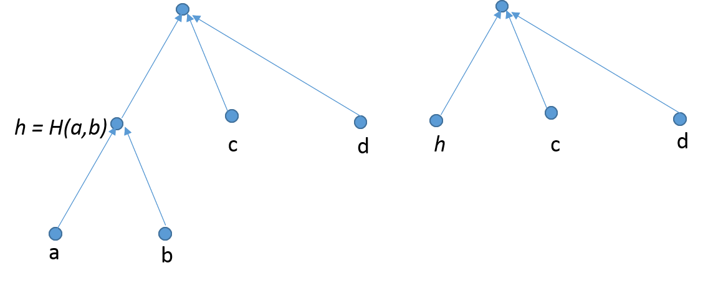

\newpage

# Abstract

In this report I propose a way to cryptographically hash algebraica datatypes. 
The Hashing protocol essentially involves converting the algebraic datatype to 
a Sakura tree hash coding. Cryptographic hashing of algebraic data types is a 
nontrivial problem. In order to Hash algebraic data types in Haskell, one must 
ensurethat different values of same data types yield different hashes while 
ensuring thatthe same hash is not generated by any value of some other data type. 

\newpage

# Acknowledgement

I would like to express my sincere gratitude to my supervisor Dr. Piyush Kurur 
for providing their invaluable guidance, comments and suggestions throughout 
the course of the project. I would like to especially thank Dr. Piyush Kurur for 
constantly motivating me to work harder. Also, I would like to thank the Haskell 
community which helped me when I got stuck with non trivial issues. 

\newpage

# 1. Introduction

Algebraic Datatypes is the ultimate gift of Functional Programming. 
There are many real world applications of Algebraic Datatypes which make 
programming intuitive, and efficient. There are many Real life applications 
of hashed data structures and hashing protocols. If we find a way to hash 
Algebraic Datatypes, we could essentially hash every data structure that 
can be represented as Algebraic Datatypes in Haskell.

Cryptographic Hash of algebraic data types has a multitude of applications ranging 
from networking to blockchains.  Cryptographic hashing of algebraic data types is 
a non trivial problem. In order to Hash algebraic data types in Haskell, one must 
ensure that different values of same data types yield different hashes while 
ensuring that the same hash is not generated by any value of some other data type. 

A way to hash any given data type is using the `Hash . Serialize` function, but 
this generates trivial collisions and the ultimate goal of cryptographic hashing 
is to avoid such collisions. 

## 1.1. Organization of the report

Following section discusses related work and builds a background to Hashing
and Algebraic datatypes. The next section shows an implementation of Sakura
tree encoding followed by a wrapper to generate Merkle hash of a given string
along with briefs on methods of validating the implementation. 

\newpage

# 2. Algebraic Data Types

## 2.1. Introduction

In computer programming, especially functional programming and type theory,
an algebraic data type is a kind of composite type, i.e., a type formed by
combining other types.
Algebraic datatypes in Haskell have one or more constructors. Each data
constructor can have zero or more arguments. The definitions can be recursive
too.

One can pattern match over the constructors. Pattern matching is essentially
matching values against patterns. Apart from allowing one to match patterns,
algebraic datatypes also bind the variables to succesful matches. 

## 2.2. Generic Representation of Algebraic Datatypes

A datatype can have *parameters*, *alternatives* and *fields*
```haskell
data D p = Alt1 | Alt2 Int p
```

### 2.2.1. Alternatives
Alternatives are often called as **sums**. A typical datatype concisting only of 
alternatives is shown below. 
```haskell
    data AltEx = A1 Int | A2 Char
```
The Alternatives are very similar to another datatype `Either`. We use a similar datatype, `:+:`to 
represent alternatives generically. 
```haskell
    data a :+: b = L a | R b
```
This can also be used to represent types with more than 2 alternatives. For example the following datatype `AltEx2`,
```haskell
    data AltEx2 = B1 Int | B2 Char | B3 Float
```
could be easily repsresented using nesting as follows. 
```haskell
    type AltEx2 = Int :+: (Char :+: Float)
    -- Note the smart constructors:
    b1 :: Int -> AltEx2
    b1 = L
    b2 :: Char -> AltEx2
    b2 = R. L
    b3 :: Float -> AltEx2
    b3 = R . R
```

### 2.2.2. Fileds
Fields are often called as **products**. A typical datatype consisting only of fields is shown below. 
```haskell 
    data FldEx = FldEx Int Char
```
The Fields are very similar to another datatype, the pair, `(,)` function. We use a similar datatype, `:*:` to represent fields generically.  
```haskell
    data a :*: b = a :*: b  
```
This can also be used to represent types with more than 2 alternatives. For example the following datatype `FldEx2`,
```haskell
    data FldEx2 = FldEx2 Int Char Float
```
could be easily represented using nesting as follows. 
```haskell
    type FldEx2' = Int :*: (Char :*: Float)
    -- note the smart constructor. 
    fldEx2' :: Int -> Char -> Float -> FldEx2'
    fldEx2' x y z = x :*: (y :*: x)
```

### 2.2.3. Sum of Products 
Algebraic Datatypes in Haskell could now be represented generically as sums of products as follows. The datatype `D` that takes a parameter `p` is defined as follows. 
```haskell
    type D p = Alt1 | Alt2 Int p
```
For this datatype `D`, we can define an identical datatype `RepD` as follows.
```haskell
    type RepD p = U :+: Int :*: p
```
Here, we use _unit_ type `data U = U`, _(identical to standard type,_ `()`_)_ to represent an alternatice without fields. Also, the precedence order of `:+:` is infix 5 and that of `:*:` is infix 6, hence we need not use the parantheses. 


# 3. Hashing

A hash function is any function that can be used to map data of arbitrary size
to data of a fixed size. The values returned by a hash function are called hash
values, hash codes, digests, or simply hashes. Hash functions are often used
in combination with a hash table, a common data structure used in computer
software for rapid data lookup. Hash functions accelerate table or database
lookup by detecting duplicated records in a large file. One such application is
finding similar stretches in DNA sequences. They are also useful in cryptography.
A cryptographic hash function allows one to easily verify that some input data
maps to a given hash value, but if the input data is unknown, it is deliberately
difficult to reconstruct it (or any equivalent alternatives) by knowing the stored
hash value. This is used for assuring integrity of transmitted data, and is the
building block for HMACs, which provide message authentication.

> Pour the initial value in a big cauldron and place it over a nice
fire. Now slowly add salt if needed and stir well. Marinade your
input string by appending some strengthened padding. Now chop
the resulting bit string into nice small pieces of the same size and
stretch each piece to at least four times its original length. Slowly
add each single piece while continually stirring at the speed given by
the rotation constants and spicing it up with some addition constants.
When the hash stew is ready, extract a portion of at least 128 bits
and present this hash value on a warm plate with some garnish. 

> *- Attacks on hash functions and applications, by Marc Stevens, University Leiden, 2012*

## 3.1. Constructing a Hash Function

Figure 1 represents a method used to create Hashes of input strings. The method
is called Merkle Dangard construction.

{width=350px}

## 3.2. Tree Hashing

Merkle and others have proposed a method to authenticate any leaf with respect
to the hash at the root with a logarithmic number of hash computations.

It enables parallel computation for validation and an incremental update to the
root hash after a leaf changes. 

## 3.3. Merkle Tree

Figure 2 shows a simple Merkle tree. The black nodes represent the update
sequence if node corresponding to the blue box is changed.


{height=200px}

## 3.4. Sakura 
Sakura is a tree hash mode which is more flexible than other tree hash modes.
In Sakura you can have multiple modes of trees.

More mathematically, Sakura can be defined as following.

> ```haskell
> Sakura :: Mode -> Innerhash function -> Input -> Hash
> ```

Sakura takes Mode and innerhash function as parameters, along with the input
string that needs to be hashed. A hashing mode can be seen as a recipe for 
computing digests over messages by means of a number of calls to an 
underlying function. The hashing mode splits the message into substrings 
that are assembled into inputs for the inner function

## 3.4. Collisions in Tree Hashing

Trees in *hashing mode* could be of any shape. Figure 3 represents one such 
illustration. 

{width=350px}

We need to ensure not to have trivial collisions when having multiple shapes. 
Trivial collisions are the ones that allows one generate same hashes for two
different values. One such collision is illustrated in Figure 4.

{width=350px}

## 3.5. How Sakura Hashing works

We represent trees in terms of hops that model how message and chaining values are
distributed over nodes. There are two distinct types of hops: message hops that 
contain only message bits and chaining hops that contain only chaining values.

The hops form a tree, with the root of the tree called the final hop. Such a hop tree
determines the parallelism that can be exploited by processing multiple message hops or
chaining hops in parallel.

An example hop tree from Sakura is shown in figure 5. The Encoding for the
hop tree is represented in Figure 6.

{width=300px}

{width=300px}

In Figure 2 there are in total 7 hops: 4 message hops $M_{00}$ , $M_{01}$ , $M_{10}$ , 
$M_{11}$ , and three chaining hops $Z_{0}$ , $Z_{1}$ and $Z_{\ast}$. The final node 
contains only the final hop $Z_{\ast}$. The hops $M_{00}$ and $Z_{0}$ are in a single 
node. Similarly, $M_{10}$ and $Z_{1}$ are in a single node. The total number of nodes 
is 5.

## 3.6. Sakura Implementation

### 3.6.1. Capturing the Shape

The shape of Sakura Tree can be captured as follows:

```haskell
data HShape = InnerHash HShape
    | Concat [HShape]
    | Interleaving [HShape]
    | Slice Int Int
    | Pad BStr
```
### 3.6.2. Serial Hash Computation
Renaming types.
```haskell
    type BStr = [Word8]
    type HashF = [Word8] -> [Word8]
```
Slices a BStr from from to to.
```haskell
    my_slice :: Int -> Int -> BStr -> BStr
    my_slice from to = (drop from).(take to)
````
Computes the hash for a given string and a HShape.
```haskell
    s :: HashF -> HShape -> BStr -> BStr
    -- Serial Hash Function
    s h (InnerHash aShape) bStr = h $ s h aShape bStr
    s h (Concat l) bStr = concat $ map (\x -> s h x bStr) l
    s _ (Slice from to) bStr = my_slice from to bStr
    s _ (Pad x) _ = x
```

### 3.6.3. Parallel Hash Computation
In above definition, the computation of hashes in Concat l can be parallelised as
follows:
```haskell
    p :: HashF -> HShape -> BStr -> BStr
    -- Parallel Hash Function
    p h (InnerHash aShape) bStr = h $ p h aShape bStr
    p h (Concat l) bStr =
    concat $ parMap rpar (\x -> p h x bStr) l
    p _ (Slice from to) bStr = my_slice from to bStr
    p _ (Pad x) _ = x
```

\newpage

