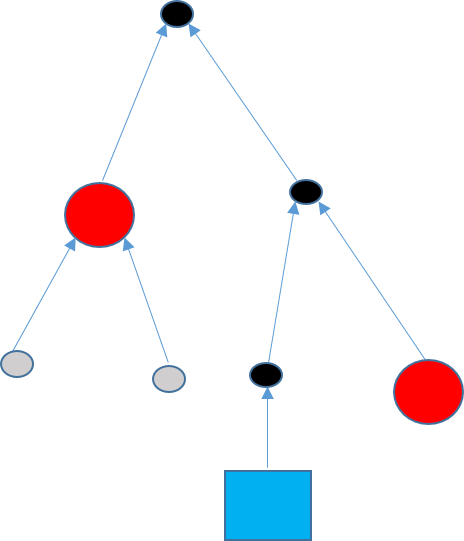
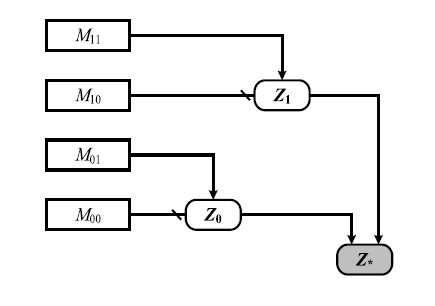
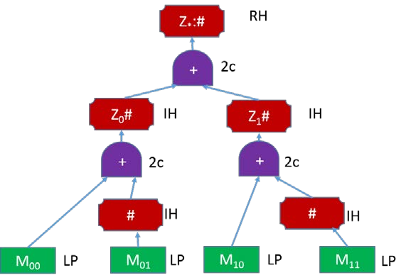

---
title: "Hashing Algebraic Datatypes"
author: [Ashutosh Upadhye]
date: 2018-04-12
subtitle: "Phase I"
titlepage: true
...

<!--Contributed by Ashutosh Upadhye. @ashutosh2411-->

\newpage

# Abstract
In this report I propose a way to Hash Algebriac Datatypes non trivially. The hashing protocol essentially involves converting the Algebraic Datatype to a Sakura Tree Hash Coding. 

\newpage

# Acknowledgement

I would like to express my sincere gratitude to my supervisor Dr. Piyush Kurur for providing their invaluable guidance, comments and suggestions throughout the course of the project. I would like to especially thank Dr. Piyush Kurur for constantly motivating me to work harder.

Also, I would like to thank the Haskell community which helped me when I got stuck with non trivial issues. 

\newpage

<!-- # Contents

-   [Preface](#preface)
-   [Acknowledgement](#acknowledgement)
-   [Abstract](#abstract)
-   [List of Figures](#list-of-figures)
-   [List of Tables](#list-of-tables)
-   [List of Abbreviations](#list-of-abbreviations)
-   [Introduction](#introduction)
-   [Problem Definition](#problem-definition)
-   [Approach](#approach)
    -   [Current](#current)
    -   [Novelty](#novelty)
    -   [Experimental Approach](#experimental-approach)
-   [Results and Discussion](#results-and-discussion)
-   [Learning and Outcome](#learning-and-outcome)
-   [Summary](#summary)
-   [Future Scope](#future-scope)

 -->

<!-- \newpage -->

# Introduction
Algebraic Datatypes is the ultimate gift of Functional Programming. There are many real world applications of Algebraic Datatypes which make programming intuitive, and efficient. 

There are many Real life applications of hashed data structures and hashing protocols. If we find a way to hash Algebraic Datatypes, we could essentially hash every data structure that can be represented as Algebraic Datatypes in Haskell.

## Organization of the report
Report is organised as follows. 

\newpage

# Related Work and Background

## Hashing
A hash function is any function that can be used to map data of arbitrary size to data of a fixed size. The values returned by a hash function are called hash values, hash codes, digests, or simply hashes. Hash functions are often used in combination with a hash table, a common data structure used in computer software for rapid data lookup. Hash functions accelerate table or database lookup by detecting duplicated records in a large file. One such application is finding similar stretches in DNA sequences. They are also useful in cryptography. A cryptographic hash function allows one to easily verify that some input data maps to a given hash value, but if the input data is unknown, it is deliberately difficult to reconstruct it (or any equivalent alternatives) by knowing the stored hash value. This is used for assuring integrity of transmitted data, and is the building block for HMACs, which provide message authentication.

> Pour the initial value in a big cauldron and place it over a nice fire. Now slowly add salt if needed and stir well. Marinade your input string by appending some strengthened padding. Now chop the resulting bit string into nice small pieces of the same size and stretch each piece to at least four times its original length. Slowly add each single piece while continually stirring at the speed given by the rotation constants and spicing it up with some addition constants. When the hash stew is ready, extract a portion of at least 128 bits and present this hash value on a warm plate with some garnish.

> Attacks on hash functions and applications, by Marc Stevens, University Leiden, 2012

### Constructing a Hash Function

### Tree Hashing
Merkle and others have proposed a method to authenticate any leaf with respect to the hash at the root with a logarithmic number of hash computations. 

It enables parallel computation for validation and an incremental update to the root hash after a leaf changes. 

### Merkle Tree

### Sakura 
Sakura is a tree hash mode which is more flexible than other tree hash modes. In Sakura you can have multiple modes of trees. 

More mathematically, Sakura can be defined as following.

$$Sakura :: Mode \rightarrow Inner hash function \rightarrow Input \rightarrow hash$$

Sakura takes Mode and innerhash function as parameters, along with the input string that needs to be hashed. 

Trees mode be of any shape.

### Collisions in Tree hashing
We need to be careful to not have trivial collisions when having multiple shapes. 

### Detailed Example of a Hop Tree from Sakura

An example  hop tree from _Sakura_: 

The Encoding for the Hop Tree looks like the following:

\newpage

# Approach
Describe the approach here. Lorem Ipsum is simply dummy text of the printing and typesetting industry. Lorem Ipsum has been the industry's standard dummy text ever since the 1500s, when an unknown printer took a galley of type and scrambled it to make a type specimen book. It has survived not only five centuries, but also the leap into electronic typesetting, remaining essentially unchanged. It was popularised in the 1960s with the release of Letraset sheets containing Lorem Ipsum passages, and more recently with desktop publishing software like Aldus PageMaker including versions of Lorem Ipsum.

## Current
Describe the current approach to solve the problem here. Lorem Ipsum is simply dummy text of the printing and typesetting industry. Lorem Ipsum has been the industry's standard dummy tex
## Novelty
Describe why your approach is novel and what are the perks of using your approach. Lorem Ipsum is simply dummy text of the printing and typesetting industry. Lorem Ipsum has been the industry's standard dummy text ever since the 1500s, when an unknown printer took a galley of type and scra
## Experimental Approach
Describe the experimental or simulational approach. Lorem Ipsum is simply dummy text of the printing and typesetting industry. Lorem Ipsum has been the industry's standard dummy text ever since the 1500s, when an unknown printer took a galley of type and scrambled it to make 

\newpage

# Results and Discussion
The Result and Discussion goes here. Lorem Ipsum is simply dummy text of the printing and typesetting industry. Lorem Ipsum has been the industry's standard dummy text ever since the 1500s, when an unknown printer took a galley of type and scrambled it to make a type specimen book. 

|Header1|Header2|Header3|
|-------|-------|-------|
|Value1 |Value2 |Value3
_Table 1: Sample Table_

It has survived not only five centuries, but also the leap into electronic typesetting, remaining essentially unchanged. It was popularised in the 1960s with the release of Letraset sheets containing Lorem Ipsum passages, and more recently with desktop publishing software like Aldus PageMaker including versions of Lorem Ipsum.

\newpage

# Learning and Outcome
Describe what you've learnt and the outcome of the internship, a prototype, a product design etc. Lorem Ipsum is simply dummy text of the printing and typesetting industry. Lorem Ipsum has been the industry's standard dummy text ever since the 1500s, when an unknown printer took a galley of type and scrambled it to make a type 

\newpage

# Summary
Summarize the work here. Lorem Ipsum is simply dummy text of the printing and typesetting industry. Lorem Ipsum has been the industry's standard dummy text ever since the 1500s, when an unknown printer took a galley of type and scrambled it to make a type specimen book. It has survived not only five centuries, but also the 

\newpage

# Future Scope
Describe the future scope of the work, improvements, analysis etc. Lorem Ipsum is simply dummy text of the printing and typesetting industry. Lorem Ipsum has been the industry's standard dummy text ever since the 

\newpage
